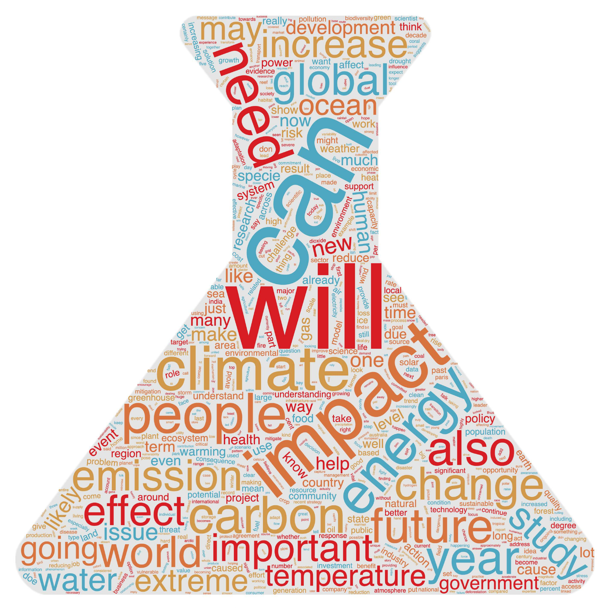
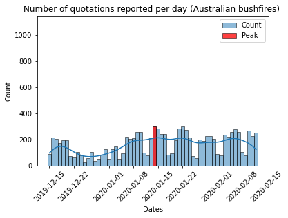

<!-- #  Is the climate debate unequal? -->

#  Abstract

It is no surprise to anyone reading this data story that climate change has been a source of polarizing discussion for the last few years. Indeed, it becomes more and more apparent from natural events (floods, heatwaves and so on) that something is happening and our societies are reacting. Consequently, measures are taken by decision makers about how to mitigate it. Scientists are getting interviewed, politicians give speeches and all of this is delivered by the media. Such influence can be studied through the analysis of who and what they quote in their articles. The Quotebank dataset offers such a possibility, thanks to its 178M quotes from which climate change related quotes can be extracted. In this sense, the goal of this study is to better understand how the climate change debate has been evolving by analysing its speakers and how a few events are representing the development of the debate. In that way, it will be possible to explore possible directions to follow in order to improve it.

# Table of Contents
* [From 116 million quotes to "a few" hundred thousands](#intro)
* [Who is talking about climate change?](#who)
* [A timeline of climate debate](#timeline)
* [Do we observe any seasonality?](#annualtrend)
* [The eternal rivalry between republicans and democrats](#rep)
* [A science issue for science people](#science)
* [Trump here, Trump there, Trump everywhere...](#trump)
* [Okay for politics, and what about natural events?](#nature)
* [There is a disturbance in the debate...](#covid)
* [Extra : And women in all of this?](#extra)
* [Conclusion](#conclusion)

#  From 116 million quotes to "a few" hundred thousands

Quotebank is a dataset of 178 million unique, speaker-attributed quotations that were extracted from 196 million English news articles crawled from over 377 thousand web domains between August 2008 and April 2020. Here, we focus on the years between 2015 and 2020 that are comprised in 116M quotes. The quotations were extracted and attributed using Quobert, a distantly and minimally supervised end-to-end, language-agnostic framework for quotation attribution.

To analyse the different events we have chosen, we first needed to determine which quotes were talking about climate change. To do so, we tested different methods but got the best results by just using a small lexicon of expressions linked to climate change (using only words would lead to unreliable results). The expressions we used are the following : ‘climate change’, ‘climate emergency’, 'renewable energy', 'climate crisis', 'greenhouse effect', 'renewable energies' and ‘global warming’. We wanted very general expressions, so as not to bias our future analysis. For example, we avoided including COP21 and COP26 in our lexicon to avoid the influence it could have on the nature of the quotes. We could have used many other fancy methods to filter the dataset but at the end, it is usually enough to trust our instinct and choose the most logical words with a keyword analysis.

 After some investigations in the Quotebank dataset, we noticed that there were missing data during the year 2016 (very few total number of quotes for some days in 2016). For this reason, as we study the frequency (i.e the number of climate related quotes divided by the total number of quotes), if there are only 300 quotes in total for a day, but one or even two climate quotes, then the frequency is very high compared to the mean of other days. As such, to prevent this nefast influence, we decided to use a threshold on the minimal number of total quotes. Then we keep the data of a given day only if the total number of quotes for that day is greater than the threshold. In the next figure, this effect is visually noticeable when the threshold value is 5000 total quotes per day. 



#  Who is talking about climate change?

The identity of the speakers of the climate quotes has to be properly defined to be able to understand possible inequalities. Firstly, we can put on a map of the world the corresponding number of quotes per country. Unsurprisingly, we observe that most of the quotes come from English speaking countries. This has to be taken into account in their analysis as obviously, more quotes will be linked to the US or countries of the Commonwealth. We let you play a little bit with the map and catch us in the rest of the analysis afterwards! You should also realise that the scale is logarithmic ! 



Now we can study the occupations of the speakers related to the quotes. In the next graph, we observe that the main profession that is interviewed or quoted in articles is politician. Next, which is something positive, are the researchers. They are the second most quoted professionals but at the same time their number of quotes pales in comparison to all of the other non scientific professions, such as actors, businesspersons, and so on. We will later on focus on the differences between politicians and researchers. Because of this imbalance, we are missing the sentiment and opinion of other professions.



{% include imagetextleft.html figname="gender_pie.html" title="The proportion of gender minorities !" description="> Gender is also an important aspect to consider when analysing who is speaking about climate change. As always, not surprisingly, the overwhelming gender is... Drumrolls... males!  We also tried to extract non binary genders with different keywords, and they represent only 0.1% of the speakers. Actually, they represent 0.24%[1](#myfootnote1) of the population so there is a clear gap, in addition to the gap for women." %}
#  A timeline of climate debate

When looking at the count of quotes talking about climate change from 2015 to early 2020, what striked us, apart from the three distinct peaks, was the very low number of quotes during some months in 2016 and 2017. We need to take this into account when looking at frequency plots. Indeed if we plot the frequency of quotes talking about climate over all quotes from 2015 to 2020, we see some very important peaks around the low count months of 2016 and 2017. We must therefore ignore these months as a very low count skewes the frequencies way too high. The next graph represents the timeline of the quotes related to climate change in frequency in ‰ (defined by the number of climate quotes in a day divided by the total amount of quotes the same day). A linear regression has also been performed on the frequency of the said quotes. The slope of this regression is slightly positive and we notice that from 2018 until beginning of 2020, the trend is clearly increasing, juste before falling due to the Covid crisis, which shook (a bit) the world.



#  Do we observe any seasonality?
We decided to put on the same graph the annual distribution of climate quotes from January to December. In those distribution, two seasonal patterns are noticeable. Unfortunately, due to the small amount of years in this dataset, it is difficult to extract any other pattern. Indeed, we would need more years to observe more precise trends. However, the mentioned patterns are due maybe due to the extreme events occuring usually more in the summer seasons. In june, there is a peak, related to the catastrophic events occuring in the US (for example the wildfires in the West coast and the hurricanes in the East coast). Also, in the "North hemisphere winter" months, an increasing trend is noticeable and it might also be related to natural events in the south hemisphere. As we tend to associate the month of november and december with cold weather, in the south it is the opposite. This is when wildfires are the most expected in Australia. As it is an English speaking country part of the Commonwealth, it is natural to expect many quotes related to this country in the Quotebank dataset. Moreover, we excluded the year 2020 because it was an incomplete annual dataset and the covid crisis has such a big influence from mid February that the trend would not be very speaking.

What else can cause these late increases? Each year, the emission gap report (EGR) is published by the UN to help decision makers to grasp the annual climatic situation. In other words, it is kind of like the little brother of the IPCC's report published every 6 to 7 years. However, its publication does not go unnoticed in the press as it triggers a spike in climate change related quotes. 

A weird behavior should still be mentioned : in 2018, the trend is almost only increasing the whole year. Did nothing happen this year ? Or people are juste becoming slowly and steadily more interested in climate change?





#  The eternal rivalry between republicans and democrats

Let's now talk a little bit of politics ! Here it is noticeable that as expected, republicans talk less than democrates about climate change. Indeed, it has been reported in several reports that they consider climate change less as a top priority than democrats [2](#myfootnote2). Republicans have historically been pretty skeptical about climate change, they tend to favor the development of their industries over the wellbeing of the atmosphere. Something quite surprising is the fact that the republicans even talk less and less about the climate. What do we do when we realise we are wrong about something? We tend to stay silent. In the same way Trump avoided talking about coronavirus after catching it, republicans might realise the urgency of mitigating the GHG emissions and are running out of arguments to counter argument this movement.

{% include imagetextright.html figname="prop_demo_rep_good.html" title="Another theory" description="> Another reason for this decrease might be related to the election in 2017 of Trump. Being the leader of the country with a great influence over his party, his scepticism towards global warming might have convinced his fellow politicians to talk less about it.  All the while, the trend for democrats remains very steady. It would be interesting to analyse this for previous years as well, it would show if this is a long term trend or not." %}

#  A science issue for science people

Let's now take a bigger perspective on the speakers and study the differences between the allocated quotes between researchers and politicians. We should give more time of speech to scientists, right? They are the one knowing what they talk about, aren't they? Hell no! From the graph here below, it is clearly observable that scientists are not given that many opportunities to express their knowledge compared to politicians which are quoted twice as many than scientists. Even though it is not necessarily dramatic, as politicians are mainly the spokepersons of the people, giving more weight to the voices of the climatologists, anthropologists and so on would help to push the debate further. Indeed, as studies show it, people tend to trust less and less their leaders[3](#myfootnote3). 

{% include imagetextleft.html figname="prop_research_pol.html" title="Vote for me !" description=">While the frequency of scientists quotes increases slowly over the period we’re studying, the frequency of politicians quotes go up significantly (31% vs 55% increase). This indicates that politicians are more and more involved in the climate debate possibly because of the growing public interest around the subject and therefore the proponent space it is starting to take in the public debate. To win an election now, you cannot ignore the climate debate. Is it related to actual concern on climate change or just as a political lever to get elected?" %}

You guessed it, we also throw word clouds at you :surprise!: The erlenmeyer flask represents the cloud for the researchers. In the second one, the man in a suit represents the cloud for the politicians. Even though some words are redundant, like "will", "impact", "can", "energy", "climate", we observe some differences. For example, the politicians talk more about "community", "country", "government". The words "need" and "people" are slightly bigger for politicians as well as "state". When we consider the scientists, we see more words such as "carbon", "extreme", "water", "temperature", "ocean". We clearly see that they are talking more about the issues itself while politicians talk more about the social implications. This is understandable when their role is to unite and reassure, while the scientists' role is to share knowledge and warn about future events. Scientists talk about science, politicians talk about community, everything is right, isn't?

  
   

#  Trump here, Trump there, Trump everywhere...

Yes, it is him again ! From the timeline, it is clearly noticeable that the event causing the highest volume of quotes is the decision of Trump to leave the Paris' Agreements. As such, a sentimental analysis is interesting to be performed around this event. Here below, we observe that around the said date, 1st of June 2017, the sentiment is pretty negative. The horizontal plot is the sentiment mean, the red bars represent the negative sentiments and the blue the positive ones. Before and after the event, the distribution of sentiment is pretty balanced, but Trump shifted this trend with his announcement that lead to a very negative sentiment. The million dollar question now is to determine if people were very concerned by the USA leaving the Agreements, or more about another event putting Trump in the spotlight?



#  Okay for politics, and what about natural events?

One of the major events of the previous years : the massive wildfires in Australia that lasted weeks and killed billions (yes yes, billions[4](#myfootnote4)!) of animals. When looking at the volume around this event, in january 2020, we observe that there is no massive peak (right plot), at least compared to the political/diplomatic events such as Trump's announcement of leaving the COP21 (left plot). We chose this event because it was happening in a country of the Commonwealth which usually have a significant amount of quotes. Nonetheless, this had no influence on the volume of quotes, or at least not enough. Do people even care about these catastrophes ? Or why do media talk more about Trump's announcement than a destructive event that costed lives ? Obviously, media nowadays rely on clicks as most of them provide free content in the internet. It is known from everyone that Trump actions and speeches attract a lot of attention and this is not necessarly helpful in the debate as people will focus on the person rather than on the content. Why so ? Because the volume of quotes is a big peak on this date without any modification afterwards. However, in the plot for the bushfires, there is a low number of quotes before the first articles on the 13th of January and afterwards it stays higher in the long run.

  
   

#  There is a disturbance in the forc... I mean debate!

From the volume study and as mentionned above, we have a significant drop of quote volume during the Covid crisis, as confirmed in the plot below. This seems logical but has a deep significance. Climate change, in our developed countries, is more a distant danger than an immediate threat. As the quotes are mainly coming from English speaking countries such as the UK or North America, which are less subject to the environmental consequences of climate change, these quotes are heavily influenced by the actuality of those countries. Because global warming is a constant but mild threat in these regions of the world, news related to climate are expected to be easily replaced by more immediate information. Let's come back to the covid crisis. When every country had to close its borders, shops, and schools, there was no more discussion on "oh let's talk about regulations to avoid elevation of the sea level in 20 years" when thousands of people were dying right now. Also, the quotes are heavily location-dependent. Island countries are at the frontline of the climate consequences.



#  Extra : And women in all of this?

On top of climate change, gender inequalities is one of the most critical issues of our modern societies. It could be interesting to see, as a bonus to this study, how women are considered in the climate debate. Fortunately, we come (finally) with good news! When looking at the overall trend of speakers categorized by thy gender, we see that the climate debate is opened more and more for women. Even though it is still far from perfect parity, it looks like there is a convergence to the mean. Indeed, male speakers still have more quotations than non male speakers but the latter have an increasing trend, better than the overall trend when taking the entirety of the dataset (not just climate quotes). It is the inverse behavior for men : they have a decreasing overall fraction of quotes, and even more so when focusing in climate quotes. Maybe climate is a more open-minded topic than the average? Finally a positive touch!



#  Conclusion

Climate change is a paradox : nothing close to climate change has happened so quickly in the history of the planet, but nothing is slower at the scale of our individual lifes. It should be a 24/7 top priority in order to allow a better future for the next generations but we are quickly caught by more immediate issues, legitimately of course. Those immediate issues, as showed in this study, are for example the covid crisis. It is hard to focus on the climate threat with such right-here-right-now issues in our plate. Also, the media has a crucial and very impactful influence on the debate. They are the one deciding what is published and what is not. As most of the news nowadays are free digital articles, they heavily rely on advertisements to survive. As this depends on the number of clicks, they need to attract as many users as possible. And what do people like ? Fresh, eye-catching news that does not feel too serious and boring. The debate would go much more forwards with more listening to scientists' voices as they are usually more factual. The debate is however going in the right direction are speakers are more and more equal in gender and in profession, while scientists and politicians keep talking about what they know.
#  References

<a name="myfootnote1">[1]</a> : [What Percentage of the Population is Transgender](https://worldpopulationreview.com/state-rankings/transgender-population-by-state)

<a name="myfootnote2">[2]</a> : [Study on how different democrats and republicans are concerned about climate change](https://www.pewresearch.org/fact-tank/2020/02/28/more-americans-see-climate-change-as-a-priority-but-democrats-are-much-more-concerned-than-republicans/)

<a name="myfootnote3">[3]</a> : [Research done on the trust in the government by the US citizens](https://www.pewresearch.org/politics/2021/05/17/public-trust-in-government-1958-2021/)

<a name="myfootnote4">[4]</a> : [Australia's fires 'killed or harmed three billion animals'](https://www.bbc.com/news/world-australia-53549936)
